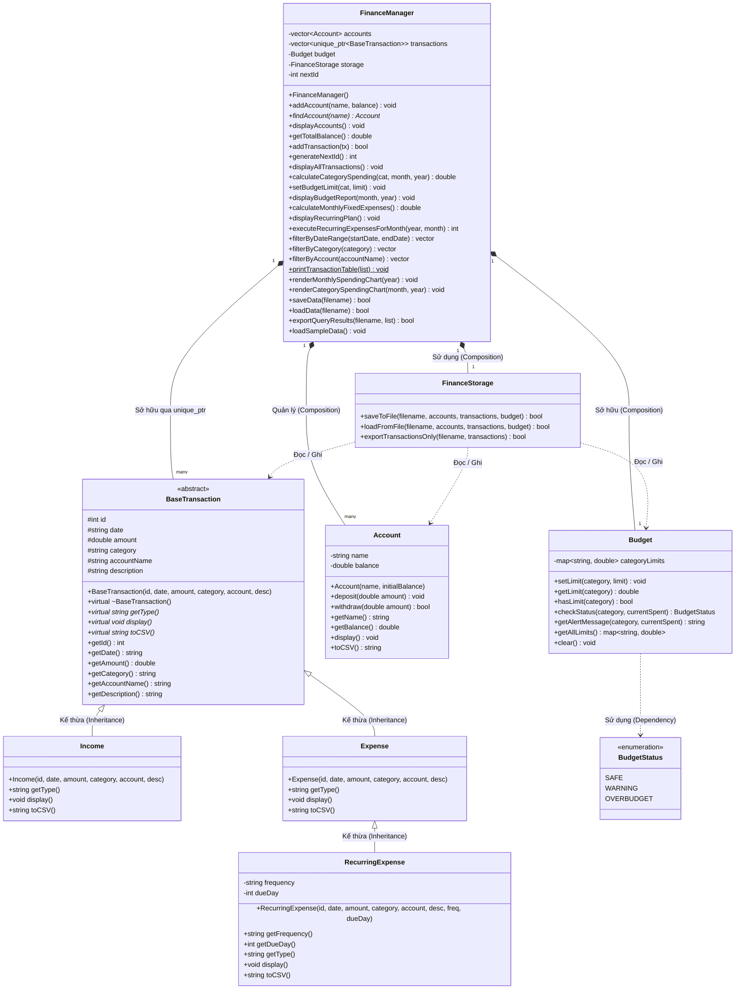

# Hệ Thống Quản Lý Tài Chính Cá Nhân (Personal Financial Management System)
> **Dành cho Sinh Viên & Freelancer | Viết bằng C++ (OOP Chuẩn)**

Dự án phần mềm quản lý tài chính cá nhân toàn diện, gọn nhẹ, dễ hiểu, đáp ứng đầy đủ 7 yêu cầu kỹ thuật và nghiệp vụ theo chuẩn bài tập lớn / đồ án môn học Lập trình Hướng đối tượng (OOP).

---

## 📑 Bảng Đối Chiếu 7 Yêu Cầu Kỹ Thuật (Requirements Checklist)

| STT | Yêu Cầu Nghiệp Vụ (Business Requirement) | Hiện Thực Kỹ Thuật (Technical Implementation) | Vị Trí Code |
|:---:|---|---|---|
| **1** | **Transaction Types** (`Income`, `Expense`, `RecurringExpense`) | Lớp `BaseTransaction` trừu tượng với các lớp dẫn xuất kế thừa, áp dụng đa hình (`virtual`) | [`include/Transaction.h`](include/Transaction.h), [`src/Transaction.cpp`](src/Transaction.cpp) |
| **2** | **Multi-Account Balances** (`Cash`, `Bank`, `E-Wallet`) | Lớp `Account` quản lý số dư riêng biệt cho từng tài khoản, nạp/rút tiền an toàn | [`include/Account.h`](include/Account.h), [`src/Account.cpp`](src/Account.cpp) |
| **3** | **Category Budget Limits & Over-budget Alerts** | Lớp `Budget` kiểm tra ngưỡng chi tiêu (An toàn, Cảnh báo 80%, Báo động Vượt mức >100%) | [`include/Budget.h`](include/Budget.h), [`src/Budget.cpp`](src/Budget.cpp) |
| **4** | **Recurring Transaction Scheduler Simulation** | Tính toán tự động tổng chi phí định kỳ hàng tháng và mô phỏng thực thi cho tháng mới | [`include/FinanceManager.h`](include/FinanceManager.h) (Hàm `calculateMonthlyFixedExpenses`, `executeRecurringExpensesForMonth`) |
| **5** | **Filtering & Searching** (Date Range, Category, Account) | Các phương thức truy vấn chuyên biệt trong lớp `FinanceManager` | [`include/FinanceManager.h`](include/FinanceManager.h) (Hàm `filterByDateRange`, `filterByCategory`, `filterByAccount`) |
| **6** | **ASCII Chart Visualization** | Sinh biểu đồ cột ASCII (`#`) so sánh chi tiêu theo tháng và theo danh mục | [`src/FinanceManager.cpp`](src/FinanceManager.cpp) (Hàm `renderMonthlySpendingChart`, `renderCategorySpendingChart`) |
| **7** | **CSV Export & Data Load** | Đọc/ghi stream tệp tin CSV đa phần thông qua lớp `FinanceStorage` | [`include/FinanceStorage.h`](include/FinanceStorage.h), [`src/FinanceStorage.cpp`](src/FinanceStorage.cpp) |

---

## 📊 Sơ Đồ Lớp Kiến Trúc Hệ Thống (UML Class Diagram)



---

### 🧩 Ứng Dụng 4 Trụ Cột OOP Trong Dự Án:

1. **Tính Đóng Gói (Encapsulation)**:
   - Các thuộc tính cốt lõi như `balance` (Account), `categoryLimits` (Budget), hay danh sách `accounts`, `transactions` (FinanceManager) đều ở phạm vi `private` / `protected`.
   - Mọi thao tác truy xuất và sửa đổi dữ liệu bắt buộc phải qua các phương thức nghiệp vụ an toàn (`deposit`, `withdraw`, `setLimit`, `addTransaction`).

2. **Tính Kế Thừa (Inheritance)**:
   - `Income` và `Expense` kế thừa từ lớp cha `BaseTransaction`.
   - `RecurringExpense` kế thừa từ `Expense` (tận dụng lại toàn bộ xử lý trừ tiền và danh mục chi tiêu, đồng thời mở rộng thêm `frequency` và `dueDay`).

3. **Tính Đa Hình (Polymorphism)**:
   - Định nghĩa các hàm ảo thuần ảo `= 0` (`getType`, `display`, `toCSV`) trong `BaseTransaction`.
   - `FinanceManager` lưu trữ `vector<unique_ptr<BaseTransaction>>`. Khi gọi `transactions[i]->display()`, chương trình tự động điều hướng đến đúng hàm của lớp con tại thời điểm chạy (Runtime Dynamic Dispatch).

4. **Tính Trừu Tượng (Abstraction)**:
   - `BaseTransaction` đóng vai trò là giao diện trừu tượng, che giấu các chi tiết cài đặt riêng biệt của từng loại giao dịch.

---

## 🏗️ Cấu Trúc Thư Mục Dự Án

```
ProjectNhi/
│
├── include/                 # Khai báo các Header file (.h)
│   ├── Common.h             # Tiện ích định dạng tiền VND, cắt chuỗi, kiểm tra ngày tháng
│   ├── Account.h            # Lớp Account (Số dư, nạp/rút tiền mặt, ngân hàng, ví)
│   ├── Transaction.h        # BaseTransaction, Income, Expense, RecurringExpense
│   ├── Budget.h             # Lớp Budget và enum BudgetStatus
│   ├── FinanceStorage.h     # Lớp FinanceStorage (đọc/ghi file CSV)
│   └── FinanceManager.h     # Bộ điều phối trung tâm và menu quản lý
│
├── src/                     # Mã nguồn thực thi (.cpp)
│   ├── Account.cpp
│   ├── Transaction.cpp
│   ├── Budget.cpp
│   ├── FinanceStorage.cpp
│   ├── FinanceManager.cpp
│   └── main.cpp             # Giao diện Console tương tác người dùng
│
├── tests/                   # Kiểm thử tự động (Unit / Integration Tests)
│   └── test_finance.cpp     # Test suite kiểm tra tự động 100% 7 yêu cầu
│
├── data/                    # Thư mục chứa dữ liệu CSV
│   └── finance_data.csv     # File dữ liệu mẫu ban đầu
│
├── bin/                     # Chứa file thực thi (.exe) sau khi biên dịch
│   ├── FinanceApp.exe       # Ứng dụng chính
│   └── test_finance.exe     # Ứng dụng test
│
├── build.bat                # Script biên dịch tự động trên Windows
├── run_test.bat             # Script chạy kiểm thử tự động
├── Git.md                   # Hướng dẫn chi tiết phân chia 7 người và các lệnh Git
└── README.md                # Tài liệu hướng dẫn sử dụng chi tiết
```

---

## 🚀 Hướng Dẫn Biên Dịch & Chạy Chương Trình

### 1. Biên dịch toàn bộ dự án (`build.bat`)
Mở PowerShell hoặc Command Prompt tại thư mục dự án và chạy:
```powershell
.\build.bat
```
*(Lệnh này tự động biên dịch cả `FinanceApp.exe` và `test_finance.exe`).*

### 2. Biên dịch thủ công bằng `g++` (MinGW / MSYS2 / GCC)
```powershell
g++ -std=c++17 -Wall -Iinclude src/*.cpp -o bin/FinanceApp.exe
```

### 3. Chạy chương trình chính
```powershell
.\bin\FinanceApp.exe
```

### 4. Chạy bộ kiểm thử tự động 7 yêu cầu
```powershell
.\run_test.bat
```
Hoặc:
```powershell
.\bin\test_finance.exe
```

---

## 💡 Hướng Dẫn Sử Dụng Menu Console

Khi khởi chạy, chương trình đã nạp sẵn bộ dữ liệu mẫu (Sample Data) dành cho sinh viên/freelancer với các tài khoản: `Cash`, `Bank`, `E-Wallet`, ngân sách và giao dịch mẫu.

* **[1] Xem số dư các tài khoản**: Bảng số dư chi tiết từng ví/ngân hàng và tổng tài sản hiện có.
* **[2] Thêm tài khoản / ví mới**: Tạo thêm các ví điện tử hoặc tài khoản ngân hàng mới.
* **[3] Thêm giao dịch mới**: 
  * Hỗ trợ 3 loại: `1. Thu nhập`, `2. Chi tiêu`, hoặc `3. Chi phí định kỳ`.
  * Tự động cảnh báo khi sắp chạm hạn mức ngân sách hoặc vượt ngân sách.
  * Tự động kiểm tra số dư và từ chối nếu không đủ tiền chi tiêu.
* **[4] Xem toàn bộ lịch sử giao dịch**: Hiển thị bảng dạng lưới danh sách tất cả các giao dịch.
* **[5] Lọc & Tìm kiếm**:
  * Lọc theo khoảng ngày (`YYYY-MM-DD` đến `YYYY-MM-DD`).
  * Lọc theo danh mục (`An uong`, `Thue nha`, `Giai tri`,...).
  * Lọc theo tài khoản (`Cash`, `Bank`, `E-Wallet`).
  * Hỗ trợ xuất trực tiếp kết quả lọc ra file CSV!
* **[6] Quản lý Ngân sách**: Xem báo cáo phần trăm đã chi so với hạn mức (tự động nhân hạn mức theo tháng/năm) và chỉnh sửa hạn mức.
* **[7] Mô phỏng Chi phí Định kỳ**:
  * Xem danh sách và tổng số tiền cố định phải chi hàng tháng (tiền nhà, internet, gym, netflix,...).
  * Mô phỏng tự động thanh toán các khoản định kỳ cho tháng mới.
* **[8] Biểu đồ trực quan ASCII Chart**:
  * Biểu đồ cột so sánh chi tiêu 12 tháng trong năm.
  * Biểu đồ cột chi tiêu từng danh mục so với hạn mức ngân sách.
* **[9] Lưu & Đọc CSV**: Lưu trữ toàn bộ dữ liệu vào file `.csv` hoặc khôi phục dữ liệu từ file.
* **[10] Nạp lại dữ liệu mẫu**: Khôi phục lại dữ liệu mẫu ban đầu.

---

## 👥 Phân Chia Công Việc Nhóm 7 Người (GitHub)
Xem chi tiết kế hoạch phân chia 7 phần, thứ tự đẩy mã nguồn và câu lệnh Git đầy đủ tại: **[`Git.md`](Git.md)**.
